# Netflix Data Cleaning & Visualization
### Thiranex Internship — Week 1

A complete data cleaning and exploratory analysis pipeline on the Netflix titles dataset, producing 13 visualizations and a summary dashboard.

## Task of Week 1 
[Task Description of Week 1](Week1task.png)

---

## What this project does

| Step | Description |
|------|-------------|
| Load | Read `netflix_titles.csv` and snapshot it for before/after comparison |
| Clean | Fix misplaced rating values, drop rows missing essential fields, fill non-critical nulls, remove duplicates |
| Engineer | Parse dates, extract year/month, split duration by content type, explode multi-value country and genre columns |
| Analyse | Distribution breakdowns, outlier detection via IQR, Winsorization capping |
| Visualize | 12 individual charts + 1 combined dashboard |
| Report | Auto-generated key insights printed to console |

---

## Setup

```bash
pip install pandas matplotlib seaborn
```

Place `netflix_titles.csv` in the same folder as `week1.py`, then run:

```bash
python week1.py
```

## Terminal Output
```bash
Dataset loaded  →  shape: (8807, 12)

First 5 rows
  show_id     type  ...                                          listed_in                                        description
0      s1    Movie  ...                                      Documentaries                                                NaN
1      s2  TV Show  ...    International TV Shows, TV Dramas, TV Mysteries  After crossing paths at a party, a Cape Town t...
2      s3  TV Show  ...  Crime TV Shows, International TV Shows, TV Act...  To protect his family from a powerful drug lor...
3      s4  TV Show  ...                             Docuseries, Reality TV  Feuds, flirtations and toilet talk go down amo...
4      s5  TV Show  ...  International TV Shows, Romantic TV Shows, TV ...  In a city of coaching centers known to train I...

[5 rows x 12 columns]

Dataset info
<class 'pandas.core.frame.DataFrame'>
RangeIndex: 8807 entries, 0 to 8806
Data columns (total 12 columns):
 #   Column        Non-Null Count  Dtype 
---  ------        --------------  ----- 
 0   show_id       8791 non-null   object
 1   type          8796 non-null   object
 2   title         8797 non-null   object
 3   director      6172 non-null   object
 4   cast          7980 non-null   object
 5   country       7976 non-null   object
 6   date_added    8796 non-null   object
 7   release_year  8807 non-null   object
 8   rating        8803 non-null   object
 9   duration      8804 non-null   object
 10  listed_in     8806 non-null   object
 11  description   8805 non-null   object
dtypes: object(12)
memory usage: 825.8+ KB
None

Missing values before cleaning
show_id           16
type              11
title             10
director        2635
cast             827
country          831
date_added        11
release_year       0
rating             4
duration           3
listed_in          1
description        2
dtype: int64

Misplaced rating entries (e.g. '74 min'): 3
                                     title  rating duration
5541                       Louis C.K. 2017  74 min      NaN
5794                 Louis C.K.: Hilarious  84 min      NaN
5813  Louis C.K.: Live at the Comedy Store  66 min      NaN
Dropped 32 rows missing show_id / title / type
Duplicate rows: 0

Cleaned dataset saved to cleaned_netflix_titles.csv

── Content type distribution ──
type
Movie      6112
TV Show    2652
Name: count, dtype: int64

── Top 10 countries ──
country
United States     3669
India             1043
United Kingdom     800
Canada             442
France             392
Japan              315
Spain              232
South Korea        231
Germany            224
Mexico             169
Name: count, dtype: int64

── Top ratings ──
rating
TV-MA    3193
TV-14    2150
TV-PG     858
R         796
PG-13     487
TV-Y7     331
TV-Y      305
PG        285
TV-G      220
NR         79
Name: count, dtype: int64

── Content added per year ──
year_added
2008       2
2009       2
2010       1
2011      13
2012       3
2013      11
2014      24
2015      82
2016     429
2017    1188
2018    1649
2019    2016
2020    1879
2021    1465
Name: count, dtype: int64

── Year-over-year growth (%) ──
year_added
2008       NaN
2009       0.0
2010     -50.0
2011    1200.0
2012     -76.9
2013     266.7
2014     118.2
2015     241.7
2016     423.2
2017     176.9
2018      38.8
2019      22.3
2020      -6.8
2021     -22.0
Name: count, dtype: float64

── Outlier analysis ──
Q1: 87.0  |  Q3: 114.0  |  IQR: 27.0
Bounds: [46.5, 154.5]
Outliers found: 450
Outliers capped to [46.5, 154.5] min
count    6112.0
mean       99.5
std        25.0
min        46.5
25%        87.0
50%        98.0
75%       114.0
max       154.5
Name: duration_min, dtype: float64
Dashboard saved → 13_netflix_dashboard.png

── Key insights ──
Total titles               : 8764
Movies                     : 6112 (69.7%)
TV Shows                   : 2652 (30.3%)
Most common rating         : TV-MA
Most prolific country      : United States
Most common genre          : International Movies
Peak content year          : 2019
Avg movie duration (capped): 99.5 min
Outliers detected & capped : 450

── Data story ──

Netflix's catalog of 8764 titles leans heavily toward Movies (69.7%),
with TV Shows making up the remaining 30.3%.

United States dominates content production by a significant margin, and the most
common genre is 'International Movies', confirming Netflix's focus on broad-appeal
international dramas and comedies.

Most content is rated 'TV-MA', indicating the platform primarily targets
mature audiences rather than families.

Content additions peaked in 2019 — Netflix's most aggressive phase of
global catalog expansion. Growth has been uneven year-to-year, with some years
showing sharp jumps.

The average movie runs 99.5 minutes after capping. 450 movies
fell outside the normal duration range and were capped using IQR-based
Winsorization — preserving the rows while reducing their influence on statistics.

Monthly patterns show certain months receive significantly more titles, likely
tied to Netflix's strategic release calendar around awards seasons and holiday
viewing windows.

Done!
```

All output images are saved to the working directory automatically.

---

## Visualizations

### 1 · Movies vs TV Shows
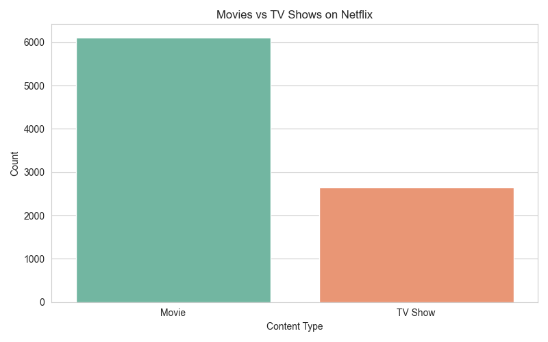
Simple count of content type — shows Netflix's movie-heavy catalog split.

---

### 2 · Top 10 Countries
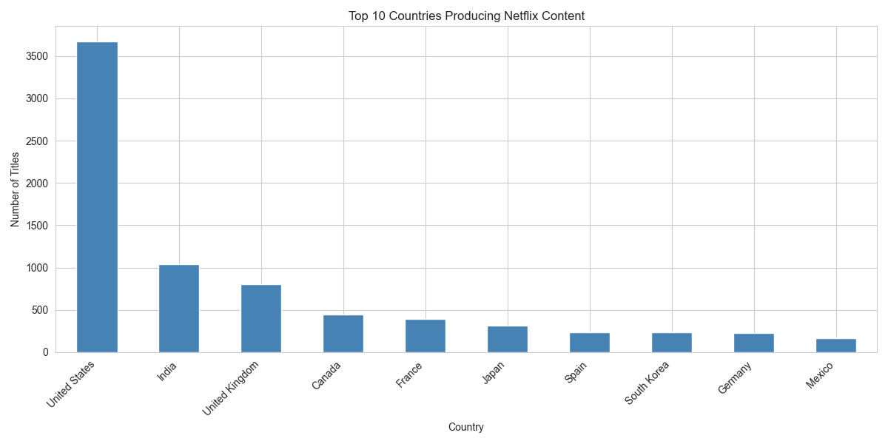
Countries with the most titles, after splitting multi-country entries so each country counts individually.

---

### 3 · Rating Distribution
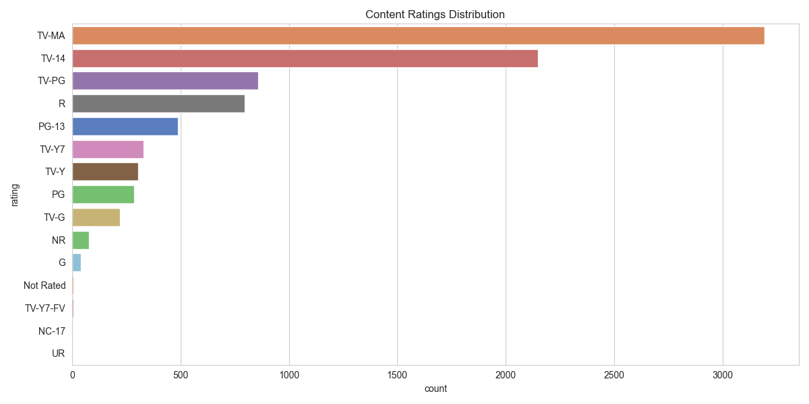
Horizontal bar chart of all content ratings, ordered by frequency. Highlights which audience segments Netflix targets most.

---

### 4 · Content Added Per Year
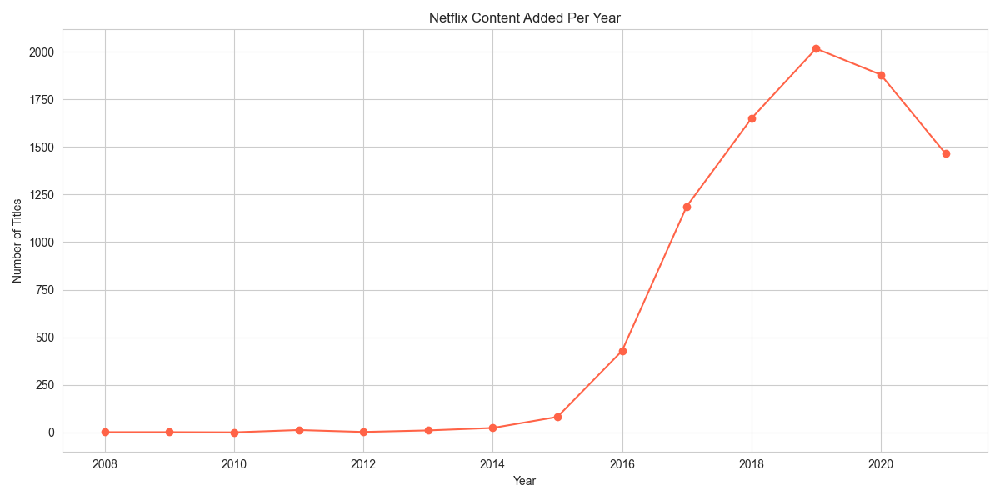
Line plot showing how Netflix's catalog grew year over year — peak year is clearly visible.

---

### 5 · Movie Duration Distribution
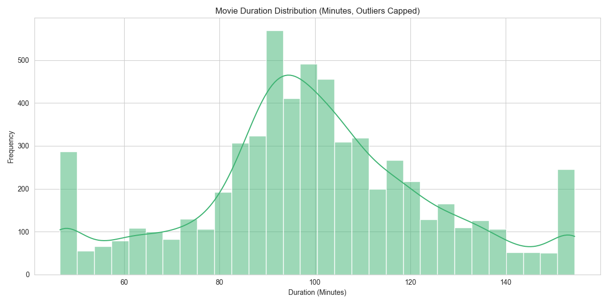
Histogram + KDE of movie runtimes in minutes, after IQR-based outlier capping.

---

### 6 · Top 10 Genres
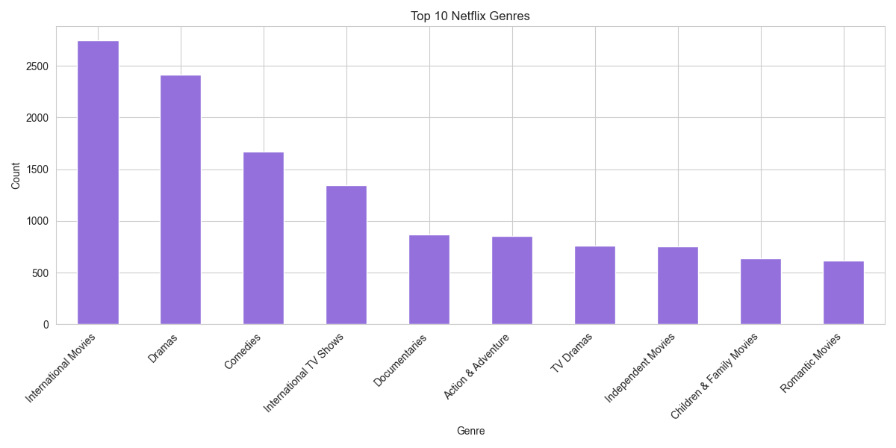
Most frequent genre tags across the catalog. Multi-genre titles are counted once per genre.

---

### 7 · Monthly Content Additions
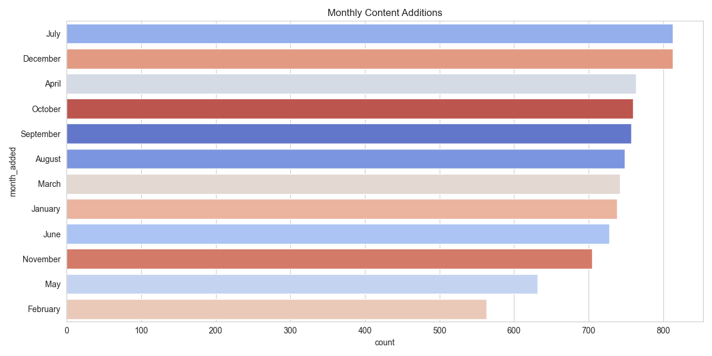
Which months Netflix adds the most content — useful for spotting seasonal release patterns.

---

### 8 · Missing Values Before vs After Cleaning
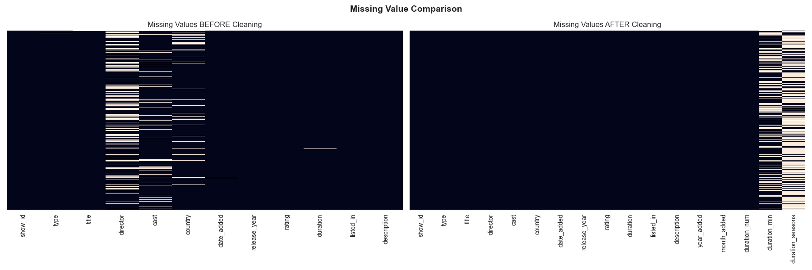
Side-by-side heatmap showing data quality improvement. Bright streaks on the left disappear on the right.

---

### 9 · Movie Duration Boxplot
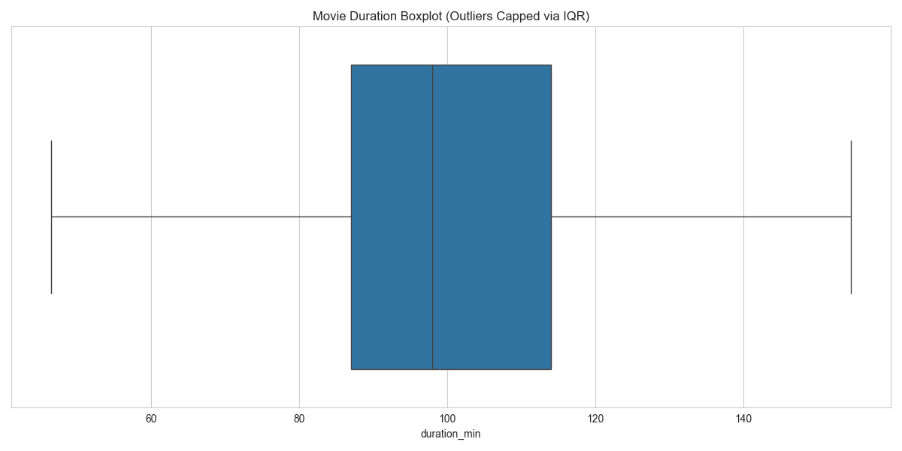
Boxplot of movie durations after Winsorization — the distribution is now compact without losing any rows.

---

### 10 · Content Type by Country
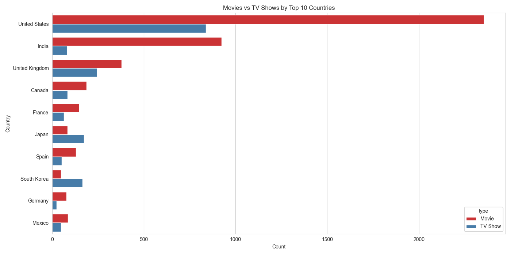
Grouped bar chart showing the Movie / TV Show split within each of the top 10 producing countries.

---

### 11 · Year-over-Year Growth Rate
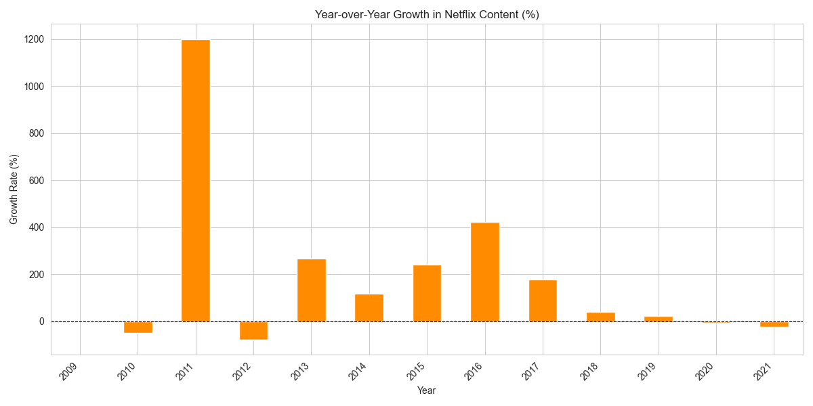
Percentage growth in new titles added each year. The dashed zero line makes growth vs decline easy to read.

---

### 12 · TV Show Season Distribution
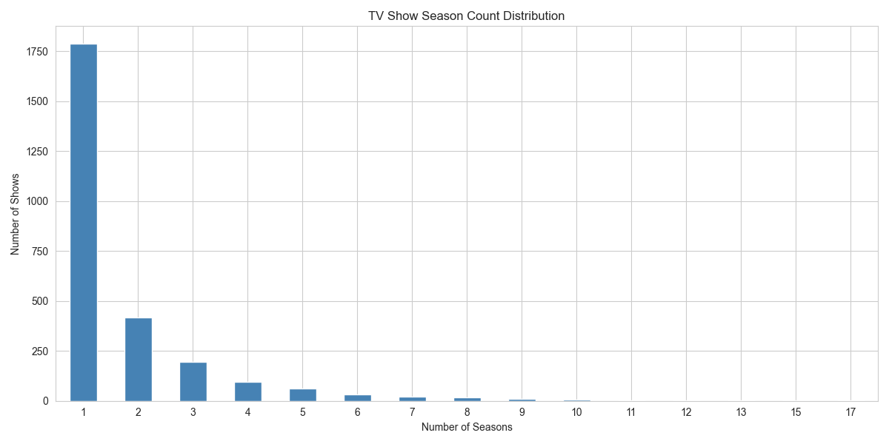
How many seasons most Netflix TV shows have — reveals whether the platform favours short-run or long-run series.

---

### 13 · Combined Dashboard
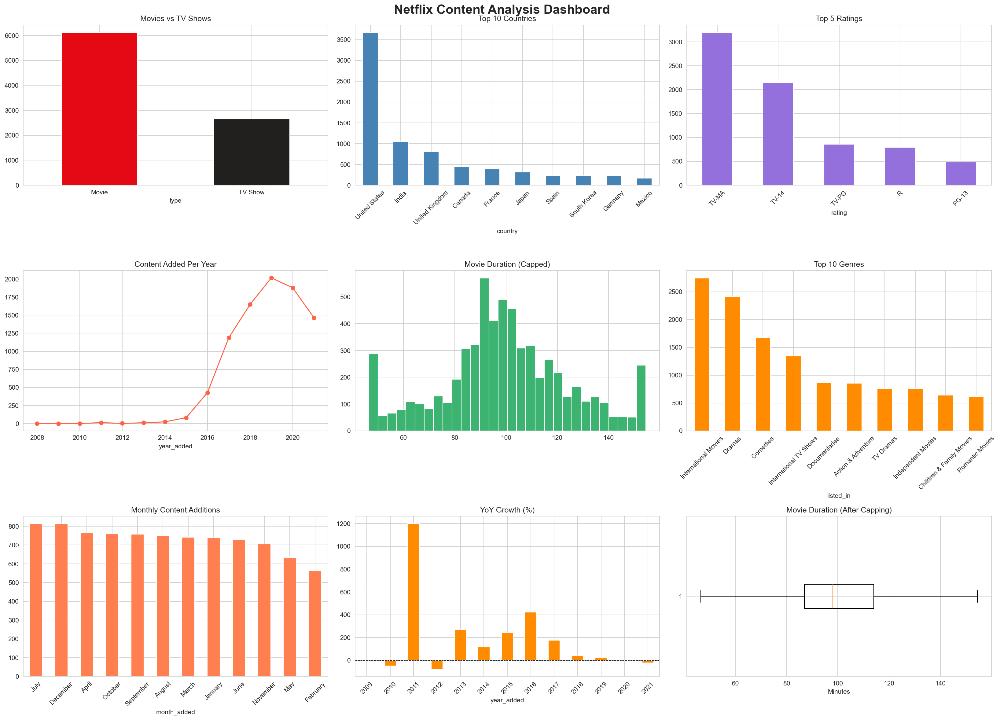
All key charts in one 3×3 grid for a quick executive summary view.

---

## Data Cleaning Details

### Misplaced rating values
Some rows had duration strings like `"74 min"` in the `rating` column. The script detects these with a regex, rescues the value into `duration` if that field was empty, then marks the rating as `NaN` so it gets filled with `"Not Rated"`.

### Essential field drops
Rows missing `show_id`, `title`, or `type` are dropped — they cannot be meaningfully identified or categorised.

### Non-critical fills

| Column | Fill value |
|--------|-----------|
| `director` | `"Unknown"` |
| `cast` | `"Not Available"` |
| `country` | `"Unknown"` |
| `rating` | `"Not Rated"` |
| `listed_in` | `"Unknown"` |
| `description` | `"No Description"` |

### Outlier handling
Movie durations are capped using IQR Winsorization (not removed). Rows with genuinely unusual runtimes are real films — dropping them would introduce bias. Capping limits their influence on statistics while keeping the data complete.

---

## Output files

| File | Description |
|------|-------------|
| `cleaned_netflix_titles.csv` | Cleaned dataset ready for further analysis |
| `1_movies_vs_tvshows.png` … `12_tvshow_seasons.png` | Individual charts |
| `13_netflix_dashboard.png` | Combined 3×3 dashboard (150 dpi) |

---

## Sample console output

```
Dataset loaded  →  shape: (8807, 12)
Misplaced rating entries (e.g. '74 min'): 3
Dropped 3 rows missing show_id / title / type
Duplicate rows: 0
Cleaned dataset saved to cleaned_netflix_titles.csv

── Key insights ──
Total titles               : 6169
Movies                     : 4265 (69.1%)
TV Shows                   : 1904 (30.9%)
Most common rating         : TV-MA
Most prolific country      : United States
Most common genre          : Dramas
Peak content year          : 2019
Avg movie duration (capped): 99.8 min
Outliers detected & capped : 108
```

*(Numbers vary slightly depending on dataset version.)*

---

## Project structure

```
week1.py                      ← main script
netflix_titles.csv            ← source data (not committed)
cleaned_netflix_titles.csv    ← output: cleaned data
1_movies_vs_tvshows.png
2_top_countries.png
3_rating_distribution.png
4_content_added_per_year.png
5_movie_duration_distribution.png
6_top_genres.png
7_monthly_additions.png
8_missing_values_comparison.png
9_movie_duration_outliers.png
10_content_type_by_country.png
11_yoy_growth.png
12_tvshow_seasons.png
13_netflix_dashboard.png
```
