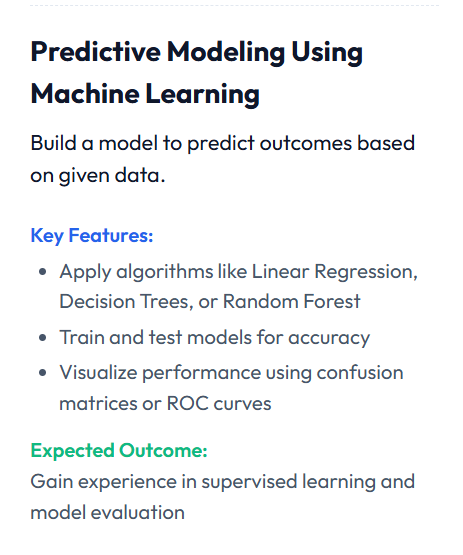
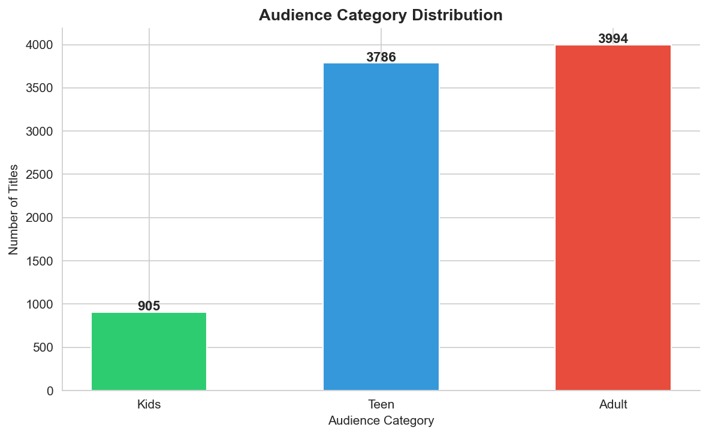
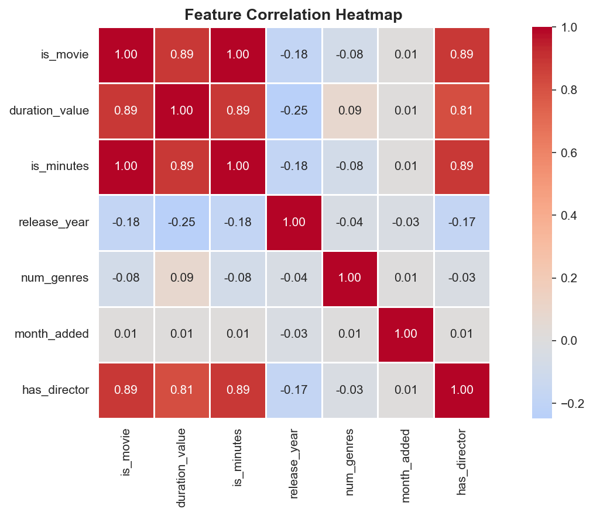
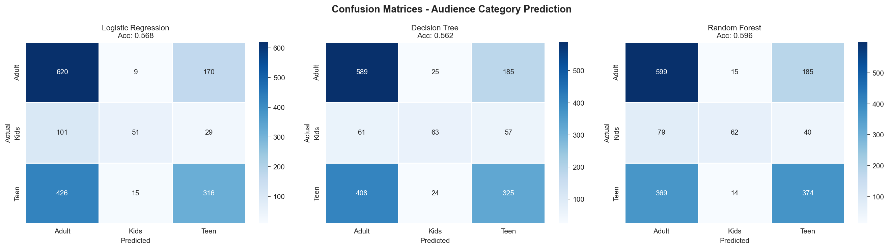
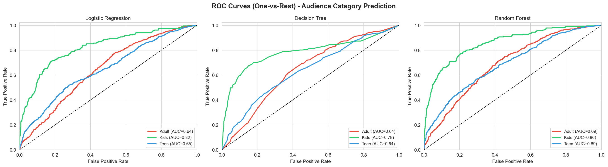
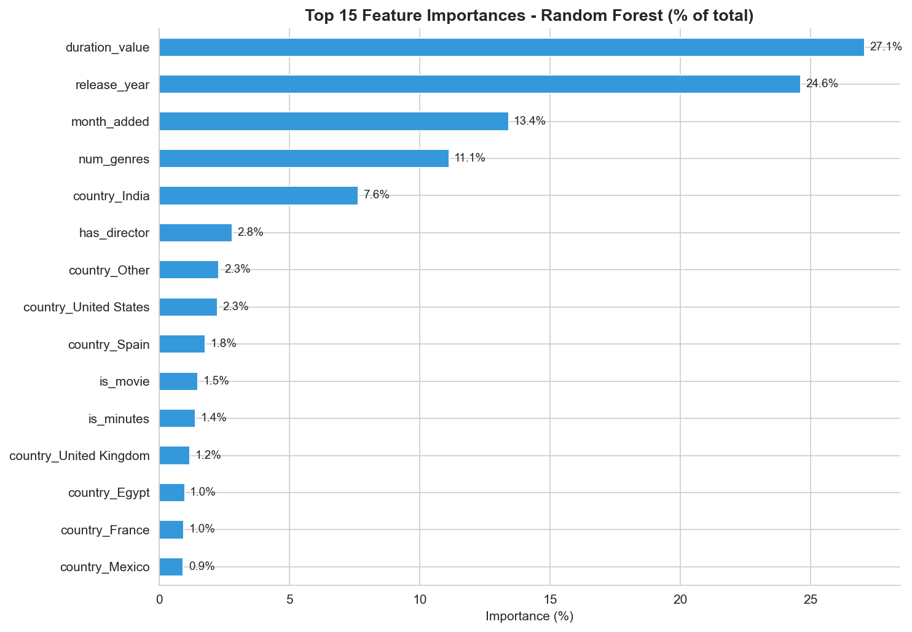
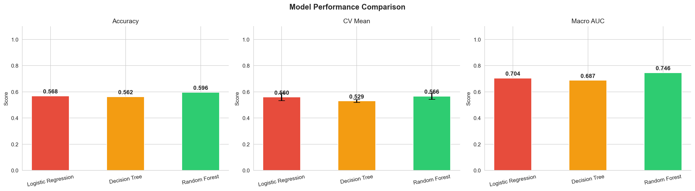
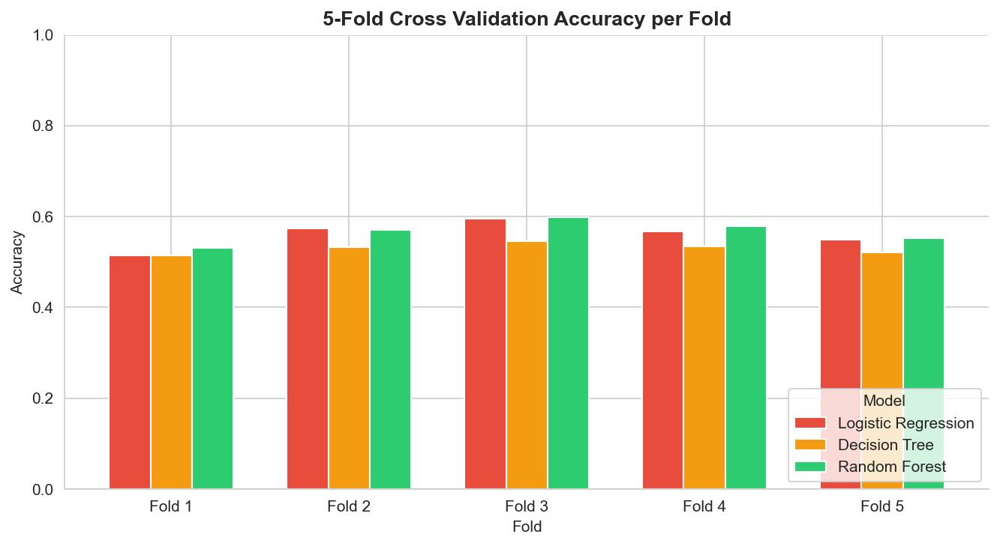

# Netflix Predictive Modeling Using Machine Learning
### Thiranex Internship — Week 2

A supervised machine learning pipeline on the Netflix titles dataset that predicts the **Audience Category** (Kids / Teen / Adult) of each title using metadata features, with hyperparameter tuning, cross-validation, and 7 visualizations.

## Task of Week 2


---

## What this project does

| Step | Description |
|------|-------------|
| Load | Read `netflix_titles.csv` and apply the same data fixes from Week 1 |
| Target | Map `rating` values to three audience groups: Kids, Teen, Adult |
| Engineer | Extract 7 numeric features + one-hot encode top 10 countries (18 features total) |
| Tune | GridSearchCV over Random Forest hyperparameters (`max_depth`, `n_estimators`) |
| Train | Fit Logistic Regression, Decision Tree, and tuned Random Forest |
| Evaluate | Accuracy, classification report, confusion matrices, ROC curves, cross-validation |
| Visualize | 7 charts saved to `week2/` |
| Insights | Business findings printed to console comparing audience groups |

---

## Prediction Target

The `rating` column is mapped into three audience categories:

| Category | Ratings Included |
|----------|-----------------|
| Kids | TV-Y, TV-Y7, TV-Y7-FV, TV-G, G |
| Teen | TV-PG, PG, PG-13, TV-14 |
| Adult | TV-MA, R, NC-17 |

Rows with `NR`, `UR`, or null ratings are excluded (122 rows dropped), leaving **8,685 titles**.

---

## Features Used

| Feature | Description |
|---------|-------------|
| `is_movie` | 1 if Movie, 0 if TV Show |
| `duration_value` | Numeric part of duration (e.g. 90 from "90 min") |
| `is_minutes` | 1 if duration is in minutes (Movie), 0 if seasons (TV Show) |
| `release_year` | Year the title was released |
| `num_genres` | Count of genres listed in `listed_in` |
| `month_added` | Month the title was added to Netflix |
| `has_director` | 1 if a director is known, 0 if "Unknown" |
| `country_*` | One-hot encoded top 10 countries + "Other" (11 columns) |

---

## Setup

```bash
pip install pandas matplotlib seaborn scikit-learn
```

Place `netflix_titles.csv` in the same folder as `week2.py`, then run:

```bash
python week2.py
```

---

## Terminal Output

```
Loaded: (8807, 12)
After audience mapping: (8685, 13)
audience
Adult    3994
Teen     3786
Kids      905
Name: count, dtype: int64

Feature matrix: (8685, 18)
Train: (6948, 18)  Test: (1737, 18)

Running GridSearchCV for Random Forest (this may take a moment)...
Best params: {'max_depth': 10, 'n_estimators': 100}
Best CV accuracy: 0.5986

Logistic Regression  Accuracy = 0.5682
              precision    recall  f1-score   support

       Adult       0.54      0.78      0.64       799
        Kids       0.68      0.28      0.40       181
        Teen       0.61      0.42      0.50       757

    accuracy                           0.57      1737
   macro avg       0.61      0.49      0.51      1737
weighted avg       0.59      0.57      0.55      1737


Decision Tree  Accuracy = 0.5625
              precision    recall  f1-score   support

       Adult       0.56      0.74      0.63       799
        Kids       0.56      0.35      0.43       181
        Teen       0.57      0.43      0.49       757

    accuracy                           0.56      1737
   macro avg       0.56      0.50      0.52      1737
weighted avg       0.56      0.56      0.55      1737


Random Forest  Accuracy = 0.5959
              precision    recall  f1-score   support

       Adult       0.57      0.75      0.65       799
        Kids       0.68      0.34      0.46       181
        Teen       0.62      0.49      0.55       757

    accuracy                           0.60      1737
   macro avg       0.63      0.53      0.55      1737
weighted avg       0.61      0.60      0.59      1737


=== 5-Fold Cross Validation ===
Logistic Regression     Mean: 0.5597  Std: 0.0270  Scores: [0.5141 0.5734 0.5947 0.5665 0.5498]
Decision Tree           Mean: 0.5294  Std: 0.0108  Scores: [0.5141 0.5325 0.5452 0.5343 0.5210]
Random Forest           Mean: 0.5663  Std: 0.0233  Scores: [0.5302 0.5705 0.5987 0.5792 0.5527]

=== Model Summary ===
              Model  Accuracy  CV Mean   CV Std  Macro AUC
Logistic Regression  0.568221 0.559701 0.026967   0.703976
      Decision Tree  0.562464 0.529419 0.010836   0.687397
      Random Forest  0.595855 0.566264 0.023333   0.745937

=== Business Insights ===

Average Release Year by Audience:
  Kids  : 2015
  Teen  : 2013
  Adult : 2015

Average Duration by Audience:
  Kids  : 33.6 mins/seasons
  Teen  : 76.7 mins
  Adult : 71.2 mins

Content Type Split (%) by Audience:
audience  type
Adult     Movie      71.5
          TV Show    28.5
Kids      TV Show    51.3
          Movie      48.7
Teen      Movie      72.2
          TV Show    27.8

Average Number of Genres Listed:
  Kids  : 1.63
  Teen  : 2.30
  Adult : 2.22

Audience split in recent content (2018+):
Adult    52.4
Teen     35.7
Kids     12.0
```

---

## Visualizations

### 0 · Audience Category Distribution


Bar chart showing the count of titles per audience group before training. Adult content dominates at 3,994 titles, Teen follows at 3,786, and Kids has 905 — a moderate class imbalance that the models must handle.

---

### 0b · Feature Correlation Heatmap


Heatmap of Pearson correlations between all 7 numeric features. Highlights that `is_movie` and `is_minutes` are perfectly correlated (both encode format type), and that `duration_value` has a strong relationship with both — confirming format is the dominant signal.

---

### 1 · Confusion Matrices


Side-by-side confusion matrices for all three models. Each cell shows raw prediction counts. All models struggle most with the Teen category — it sits between Kids and Adult content and shares characteristics with both, making it the hardest to classify cleanly.

---

### 2 · ROC Curves (One-vs-Rest)


One-vs-Rest ROC curves for each model, with a separate curve per audience class (Adult in red, Kids in green, Teen in blue). The Kids class achieves the highest AUC across all models — its content profile (short durations, TV format) is the most distinctive. Random Forest achieves the best macro AUC of **0.746**.

---

### 3 · Feature Importance (Random Forest)


Top 15 features ranked by their contribution to the Random Forest's decisions, expressed as a percentage of total importance. `is_minutes` and `duration_value` dominate — confirming that content format (movie vs. show) and runtime length are the strongest predictors of audience category.

---

### 4 · Model Performance Comparison


Three-panel comparison of Accuracy, 5-Fold CV Mean (with error bars showing ±1 std), and Macro AUC across all models. Random Forest wins on both Accuracy (59.6%) and Macro AUC (0.746). The CV error bars show Decision Tree is the most consistent but least accurate; Logistic Regression has the widest variance.

---

### 5 · Cross Validation per Fold


Grouped bar chart showing accuracy for each of the 5 folds per model. Demonstrates model stability — Random Forest and Logistic Regression both show reasonable consistency across folds, while Decision Tree underperforms in every fold, confirming it is not just an unlucky single split.

---

## Model Results Summary

| Model | Accuracy | CV Mean | CV Std | Macro AUC |
|-------|----------|---------|--------|-----------|
| Logistic Regression | 56.8% | 55.97% | ±2.70% | 0.704 |
| Decision Tree | 56.2% | 52.94% | ±1.08% | 0.687 |
| **Random Forest** | **59.6%** | **56.63%** | ±2.33% | **0.746** |

Random Forest (tuned via GridSearchCV with `max_depth=10, n_estimators=100`) is the best overall model across all three metrics.

---

## Hyperparameter Tuning Details

GridSearchCV was used to tune the Random Forest over 6 combinations (3-fold CV each):

```python
param_grid = {
    "n_estimators": [100, 200],
    "max_depth":    [10, 20, None],
}
```

**Best parameters found:** `max_depth=10, n_estimators=100`  
**Best CV accuracy:** 59.86%

This improved Random Forest accuracy from **55.2% → 59.6%** compared to the default untuned configuration.

---

## Business Insights

- **Adult content dominates recent Netflix additions** — 52.4% of titles released in 2018 or later are Adult-rated, confirming Netflix's strategic focus on mature audiences
- **Kids is the only category where TV Shows outnumber Movies** (51.3% vs 48.7%) — children's content favours episodic series over standalone films
- **Teen content has the most genre tags per title** (avg 2.30 vs 2.22 for Adult and 1.63 for Kids) — Teen titles blend more genres, which also makes them harder to classify
- **Kids content has far shorter average duration** (33.6 units) compared to Teen (76.7 min) and Adult (71.2 min) — episode length is the clearest distinguishing signal
- **Adult and Teen content share similar release year averages** (2015 and 2013) — Netflix has been acquiring both at roughly the same pace historically

---

## Feature Engineering Details

### Rating → Audience mapping
The `rating` column contains 13 distinct values. These are collapsed into three groups using a fixed lookup dictionary. Rows with ambiguous ratings (`NR`, `UR`) and the 3 misplaced duration values in the rating column (carried over from Week 1 cleaning) are excluded.

### Duration parsing
Duration strings like `"90 min"` and `"3 Seasons"` are split into a numeric value (`duration_value`) and a format flag (`is_minutes`). This separates the magnitude from the unit, since a "3" in seasons and a "3" in minutes mean entirely different things.

### Country encoding
Only the top 10 countries by title count are kept as individual categories. All others are grouped as `"Other"` to avoid a 100+ column sparse matrix.

---

## Output Files

| File | Description |
|------|-------------|
| `week2/0_class_distribution.png` | Audience category counts before training |
| `week2/0b_correlation_heatmap.png` | Feature correlation matrix |
| `week2/1_confusion_matrices.png` | Confusion matrices for all 3 models |
| `week2/2_roc_curves.png` | One-vs-Rest ROC curves for all 3 models |
| `week2/3_feature_importance.png` | Top 15 Random Forest feature importances (%) |
| `week2/4_model_comparison.png` | Accuracy, CV Mean, and Macro AUC comparison |
| `week2/5_cross_validation.png` | Per-fold accuracy for all 3 models |

---

## Project Structure

```
week2.py                          <- main script
netflix_titles.csv                <- source data (not committed)
week2/
    0_class_distribution.png
    0b_correlation_heatmap.png
    1_confusion_matrices.png
    2_roc_curves.png
    3_feature_importance.png
    4_model_comparison.png
    5_cross_validation.png
```
