# Netflix Exploratory Data Analysis (EDA)
### Thiranex Internship — Week 3

A deep exploratory data analysis pipeline on the Netflix titles dataset producing 18 visualizations, an auto-generated insights report, and a compiled 20-page PDF — covering statistical summaries, correlation analysis, time-series trends, geographic patterns, and outlier detection.

## Task of Week 3
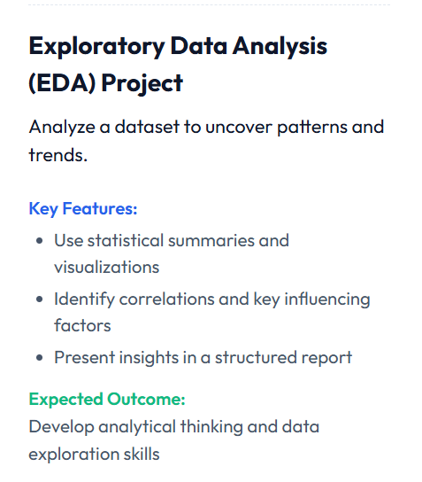

---

## What this project does

| Step | Description |
|------|-------------|
| Load | Read `netflix_titles.csv` and apply Week 1 cleaning fixes |
| Engineer | Derive year/month added, duration value, primary country/genre, audience category |
| Summarise | Statistical table (mean, median, std, skewness, kurtosis) for Movies vs TV Shows |
| Distribute | KDE + histogram distributions with mean/median lines and skew annotations |
| Correlate | Spearman correlation matrix with significance stars (* / ** / ***) |
| Associate | Cramér's V matrix for categorical feature associations |
| Trend | Genre evolution, audience strategy shift, cumulative catalog growth (2015–2021) |
| Geographic | Top 5 country growth lines + country × genre heatmap |
| Duration | Violin plots by genre + Kruskal-Wallis test + duration trend scatter + outlier analysis |
| Calendar | Monthly release heatmap showing seasonal patterns |
| Timing | Monthly stacked bar showing which audience category gets added when |
| Directors | Top 15 most prolific Netflix directors |
| Report | Auto-generated 12-section `.txt` report + 20-page compiled `.pdf` |

---

## Setup

```bash
pip install pandas matplotlib seaborn scipy numpy
```

Place `netflix_titles.csv` in the same folder as `week3.py`, then run:

```bash
python week3.py
```

---

## Terminal Output

```
Loaded: (8807, 12)
Movies: 6112 | TV Shows: 2663 | Total: 8775

Saved: week3/1_statistical_summary.png
Saved: week3/2_distribution_analysis.png
...
Saved: week3/18_outlier_analysis.png

============================================================
NETFLIX EDA — KEY INSIGHTS REPORT
============================================================

Genre Trends (2015 -> 2021):
  Fastest growing  : International TV Shows (+7.4 pp)
  Fastest shrinking: Documentaries (-15.7 pp)

Content Strategy Shift (2015 -> 2021):
  Kids  : 23.5% -> 12.9% (down 10.6 pp)
  Teen  : 32.4% -> 41.8% (up 9.4 pp)
  Adult : 44.1% -> 45.3% (up 1.2 pp)

Content Addition Patterns:
  Peak month: Jul (804 titles, 2015-2021 combined)
  Q4 (Oct-Dec) total: 2215 titles

Cramer's V — Strongest associations:
  Audience x Rating          : V=0.999 (strong)
  Content Type x Rating      : V=0.342 (moderate)
  Content Type x Country     : V=0.239 (weak)

Duration Across Genres (Kruskal-Wallis):
  H = 1986.66, p = 0.00e+00 => significant differences exist
  Shortest avg: Stand-Up Comedy (65 min)
  Longest  avg: Classic Movies  (112 min)

Geographic Insights (2015-2021):
  United States : 3111 total, growth +1000%
  India         : 1004 total, growth +9700%
  United Kingdom:  607 total, growth +1800%
  Canada        :  256 total, growth +1200%
  Japan         :  253 total, growth +4200%

Genre x Audience Findings:
  Stand-Up Comedy : 88% Adult
  Crime TV Shows  : 76% Adult
  Horror Movies   : 75% Adult
  TV Comedies     : 60% Adult
  Dramas          : 55% Adult

Saved: week3/Netflix_EDA_Report.txt
Saved: week3/Netflix_EDA_Report.pdf
```

---

## Visualizations

### 1 · Statistical Summary Table
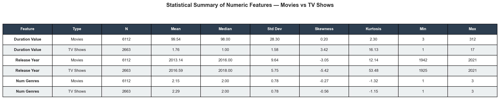

Styled table showing count, mean, median, standard deviation, skewness, kurtosis, min, and max for Duration Value, Release Year, and Num Genres — split by Movies vs TV Shows. Dark header row with alternating row shading for readability.

---

### 2 · Distribution Analysis
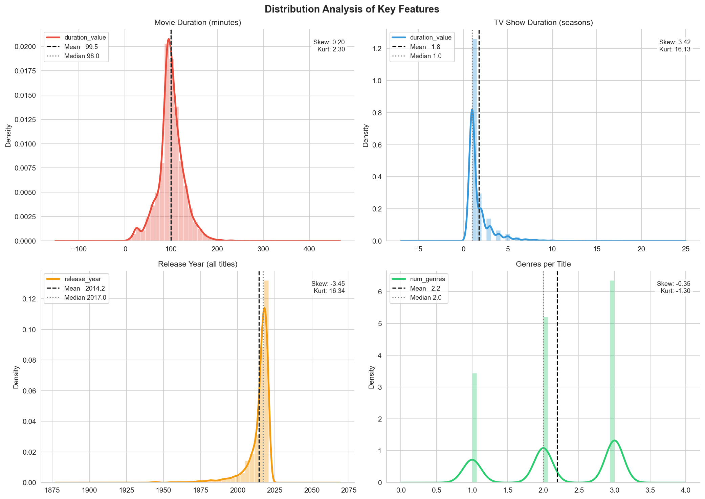

2×2 grid of KDE + histogram panels for Movie Duration, TV Show Duration (seasons), Release Year, and Genres per Title. Each panel includes mean/median reference lines and an inset box with skewness and kurtosis values.

---

### 3 · Spearman Correlation Matrix
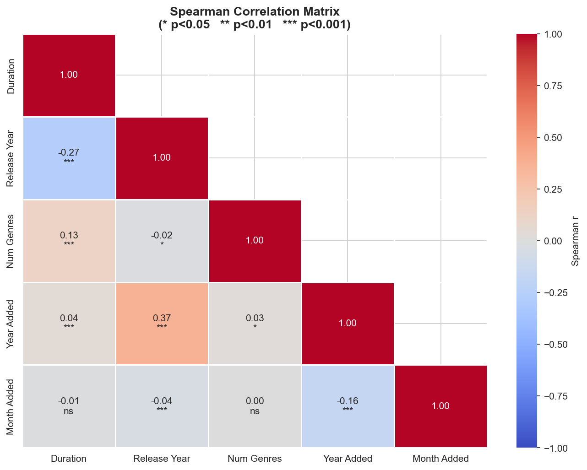

Lower-triangle correlation heatmap (coolwarm palette) for five numeric features: Duration, Release Year, Num Genres, Year Added, Month Added. Each cell shows the Spearman r value and significance stars (`*` p<0.05, `**` p<0.01, `***` p<0.001).

---

### 4 · Genre Share Evolution
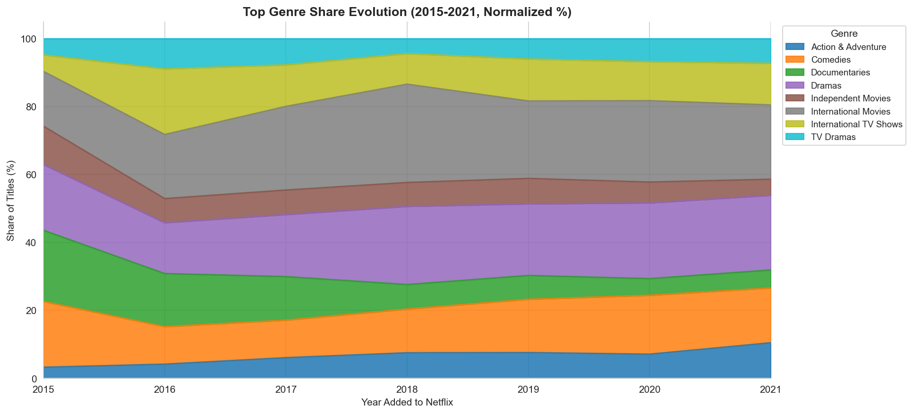

Normalized stacked area chart showing the share of the top 8 genres from 2015 to 2021. Reveals that **International TV Shows grew +7.4 percentage points** while Documentaries fell by 15.7 pp — Netflix's clearest content strategy shift.

---

### 5 · Content Strategy Shift
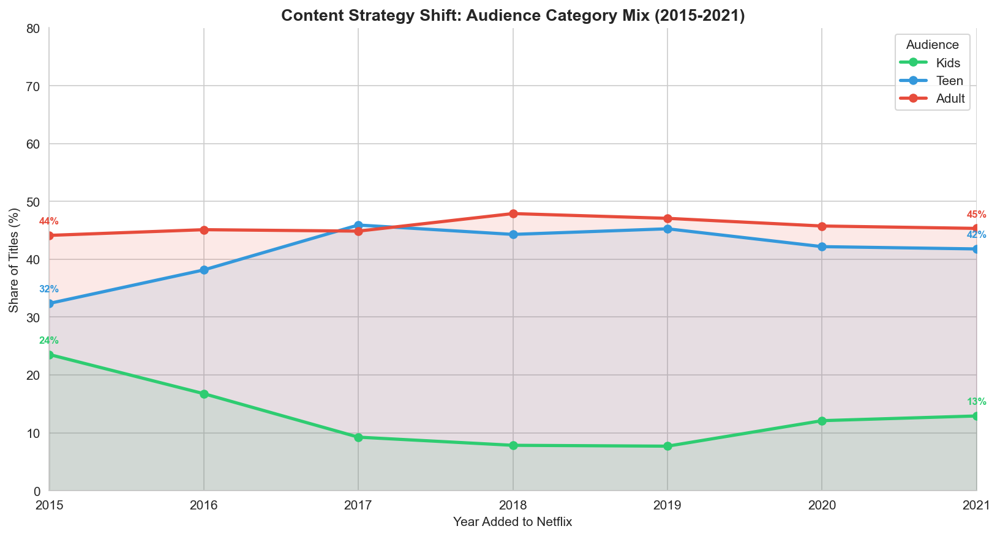

Line chart with filled areas showing the proportion of Kids, Teen, and Adult content added each year (2015–2021). Percentage labels at the start and end of each line show the direction and magnitude of the shift.

---

### 6 · Movie Duration by Genre (Violin)
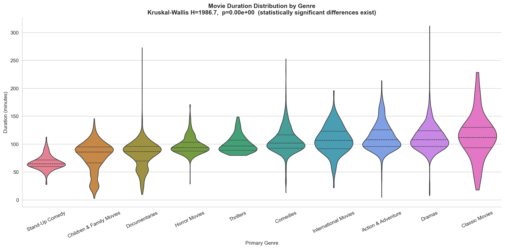

Violin plots for the top 10 primary genres, ordered by median duration (shortest to longest). The Kruskal-Wallis result (`H=1986.66, p≈0`) is shown in the title — confirming that genre has a statistically significant effect on runtime. Stand-Up Comedy (65 min median) and Classic Movies (112 min) mark the extremes.

---

### 7 · Geographic Content Growth
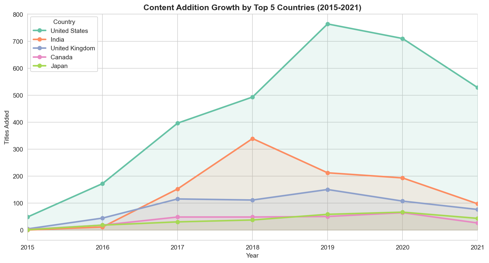

Line chart tracking how many titles each of the top 5 countries added per year from 2015 to 2021. India shows the steepest growth trajectory (+9,700%), overtaking the UK in total volume by 2019.

---

### 8 · Monthly Release Calendar Heatmap
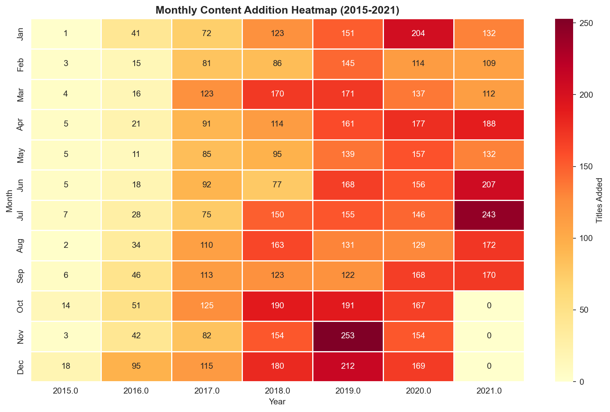

Month × Year pivot heatmap (YlOrRd colormap) showing how many titles were added each month from 2015 to 2021. July is the single highest month across all years combined (804 titles). Q4 (Oct–Dec) accounts for 2,215 titles — tied to holiday viewing windows.

---

### 9 · Cramér's V Association Matrix
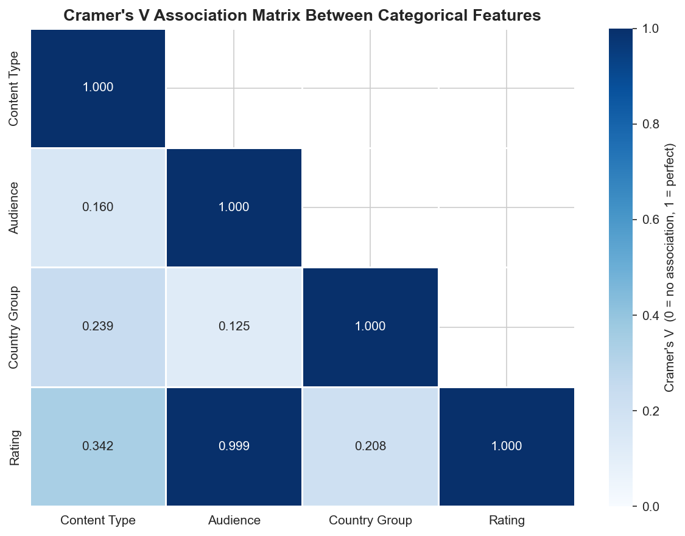

Lower-triangle heatmap measuring the strength of association between four categorical features: Content Type, Audience, Country Group, and Rating. Audience × Rating scores V=0.999 (expected — Audience was derived from Rating). Content Type × Rating is the next strongest at V=0.342.

---

### 10 · Genre × Audience Heatmap
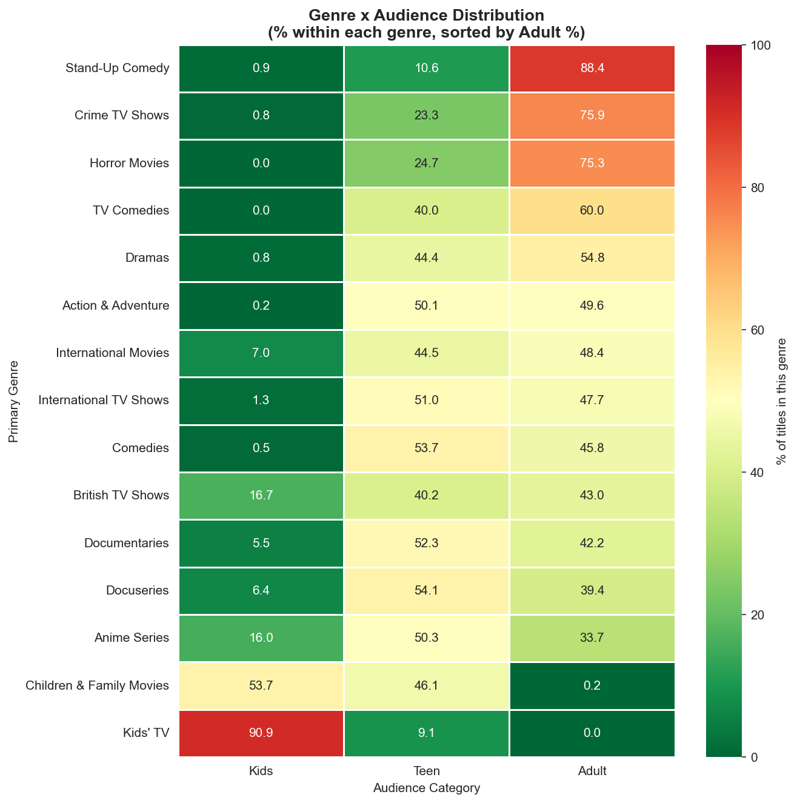

Cross-tabulation of the top 15 primary genres against audience category (Kids / Teen / Adult), normalized by row. Sorted descending by Adult %. Stand-Up Comedy is 88% Adult — the most audience-specific genre on the platform.

---

### 11 · Content Timing by Audience
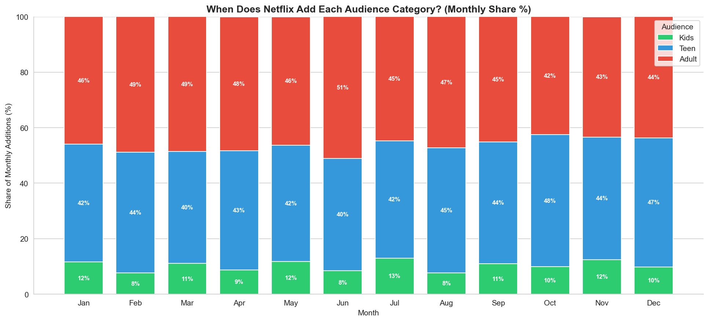

Monthly stacked bar chart showing what share of each month's additions belongs to Kids, Teen, and Adult content. The proportion stays relatively stable month-to-month, suggesting Netflix adds content proportionally rather than seasonal targeting by audience type.

---

### 12 · Executive Dashboard
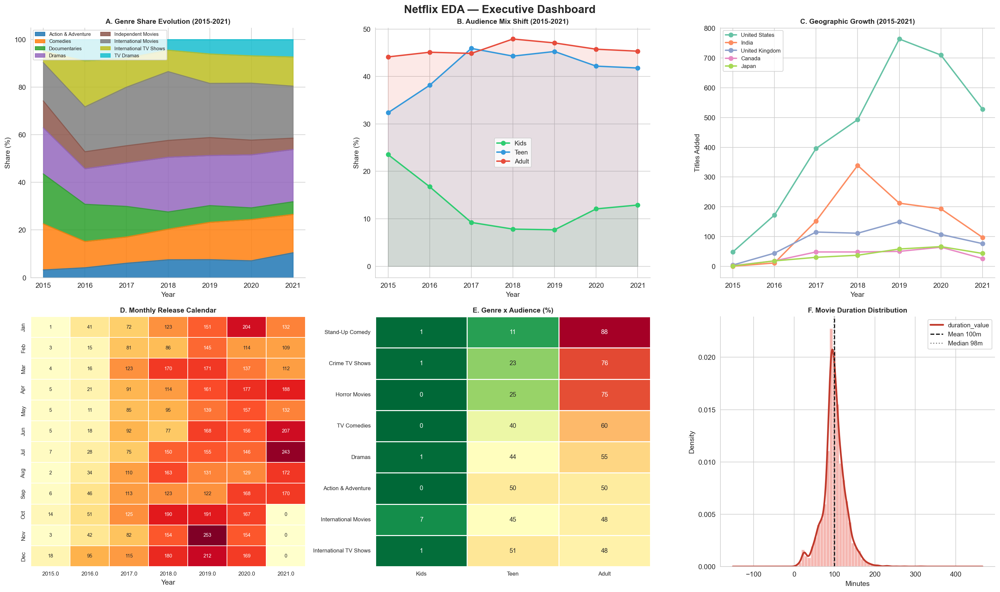

Six-panel overview combining Genre Evolution, Audience Mix Shift, Geographic Growth, Monthly Calendar Heatmap, Genre × Audience (top 8), and Movie Duration Distribution — designed as a single-glance executive summary.

---

### 13 · Business KPI Dashboard
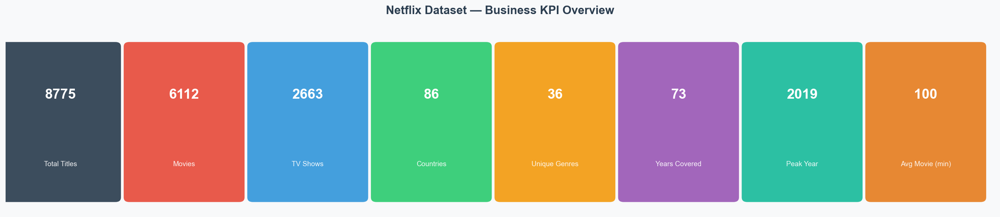

Eight colored metric cards showing: Total Titles (8,775), Movies (6,112), TV Shows (2,663), Countries, Unique Genres, Years Covered, Peak Year, and Average Movie Duration — formatted as a professional business overview page.

---

### 14 · Cumulative Catalog Growth
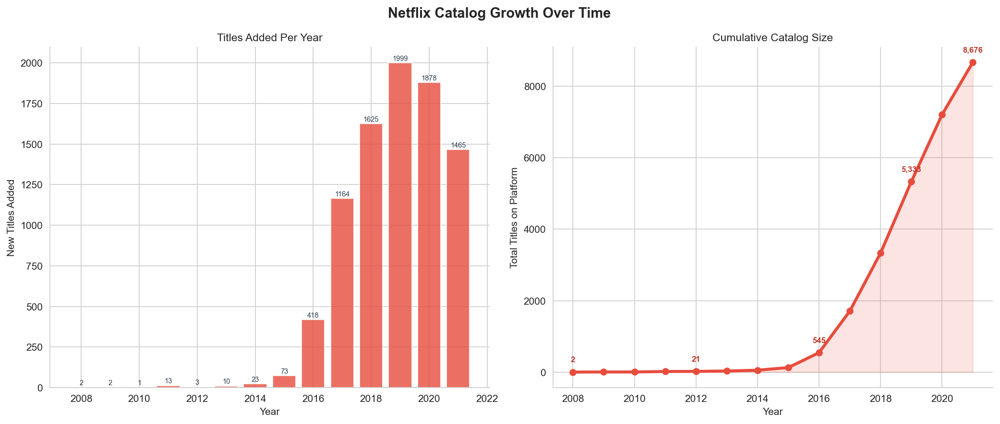

Side-by-side charts: (left) yearly new titles added as a bar chart, (right) cumulative catalog size as a curve. The catalog grew from under 500 titles in 2012 to over 8,000 by 2021. Growth peaked in 2019 and began slowing in 2020–2021.

---

### 15 · Top 15 Directors
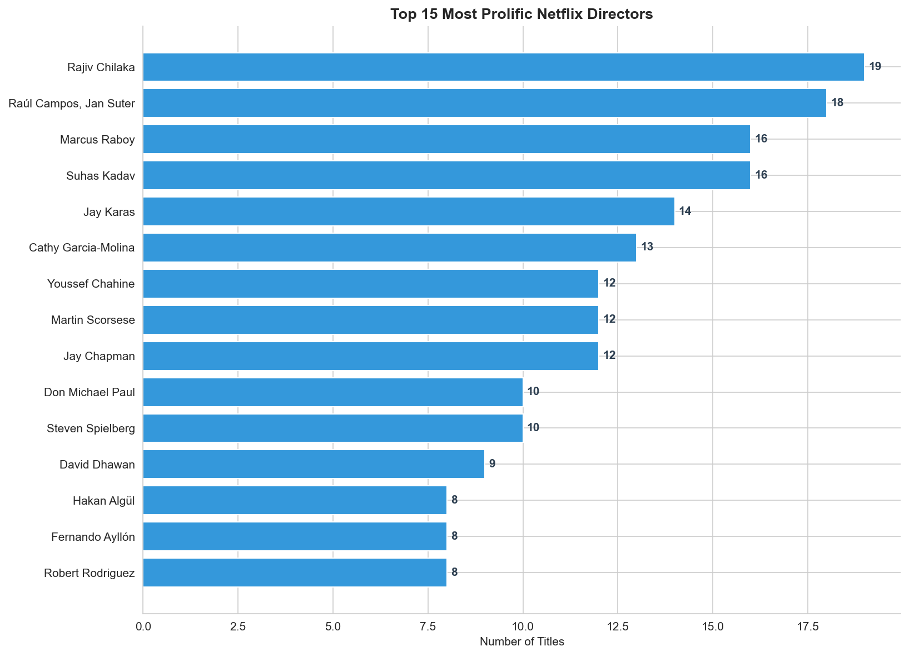

Horizontal bar chart of the 15 most prolific Netflix directors by title count. Rajiv Chilaka leads with 19 titles — mostly children's animation series, consistent with his role as creator of *Chhota Bheem*.

---

### 16 · Country × Genre Analysis
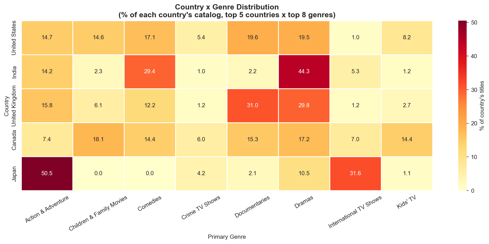

Heatmap showing what percentage of each top country's catalog belongs to each of the top 8 genres. Reveals distinct national content identities: India's catalog is dominated by International Movies, while the US leads in Dramas and Documentaries.

---

### 17 · Release Year vs Duration Scatter
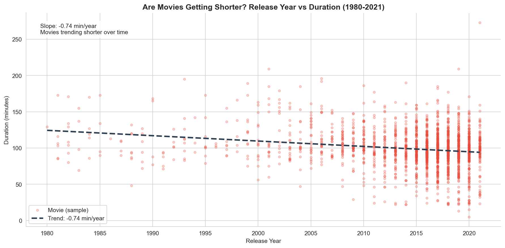

Scatter plot of 2,000 sampled movies (1980–2021) with a linear trend line. The slope of **-0.74 min/year** confirms that movies are getting progressively shorter over time — a real industry trend worth discussing.

---

### 18 · Outlier Analysis
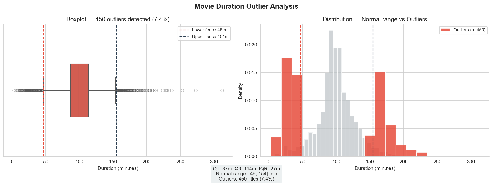

Two-panel outlier analysis using the IQR method. Left: boxplot with fence lines annotated. Right: full distribution histogram with outlier bins highlighted in red. Results: Q1=87 min, Q3=114 min, IQR=27 min, normal range [46, 154] min. **450 movies (7.4%) fall outside the bounds** — genuine edge cases (very short or very long films), not data errors.

---

## Statistical Methods Used

| Method | Applied to | Purpose |
|--------|-----------|---------|
| Spearman Correlation | Numeric features | Non-parametric correlation robust to outliers |
| Cramér's V | Categorical pairs | Measures association strength (0 = none, 1 = perfect) |
| Kruskal-Wallis H-test | Duration across genres | Non-parametric ANOVA — tests if medians differ significantly |
| IQR Outlier Detection | Movie durations | Identifies values beyond 1.5×IQR from quartiles |
| Linear Regression (polyfit) | Year vs duration | Quantifies duration trend direction and slope |
| KDE (Kernel Density Estimate) | All distributions | Smooth probability density over histograms |

---

## Key Findings

| Finding | Detail |
|---------|--------|
| Netflix is shifting away from Kids content | Kids dropped from 23.5% → 12.9% of additions (2015–2021) |
| Teen content is the fastest growing audience segment | Grew from 32.4% → 41.8% of annual additions |
| International TV Shows is the fastest growing genre | +7.4 percentage points over 6 years |
| Documentaries are declining sharply | -15.7 pp — Netflix is deprioritising informational content |
| India is the fastest growing content market | +9,700% in title additions 2015–2021 |
| Movies are getting shorter | Trend of -0.74 min/year (1980–2021) |
| Stand-Up Comedy is most audience-specific | 88% of titles are Adult-rated |
| Genre significantly affects runtime | Kruskal-Wallis H=1986.66, p≈0 |
| 450 movies are duration outliers | 7.4% of movies fall outside the IQR range |
| July is peak addition month | 804 titles added across 2015–2021 |

---

## Auto-Generated Reports

### `Netflix_EDA_Report.txt`
A 12-section structured text report covering: Dataset Overview, Statistical Summary, Genre Trends, Content Strategy, Catalog Growth, Geographic Analysis, Country × Genre, Duration Analysis, Outlier Analysis, Association Analysis (Cramér's V), Top Directors, and Recommendations.

### `Netflix_EDA_Report.pdf`
A 20-page compiled PDF including a title page, all 18 visualizations (one per page), and a findings & recommendations summary page. Generated entirely from Python using `matplotlib.backends.backend_pdf.PdfPages` — no external tools required.

---

## Output Files

| File | Description |
|------|-------------|
| `week3/1_statistical_summary.png` | Statistical table — Movies vs TV Shows |
| `week3/2_distribution_analysis.png` | KDE + histogram grid |
| `week3/3_spearman_correlation.png` | Correlation heatmap with significance stars |
| `week3/4_genre_evolution.png` | Genre share stacked area chart |
| `week3/5_content_strategy.png` | Audience mix shift over time |
| `week3/6_duration_by_genre.png` | Violin plots + Kruskal-Wallis |
| `week3/7_geographic_growth.png` | Top 5 countries growth lines |
| `week3/8_monthly_heatmap.png` | Month × Year addition calendar |
| `week3/9_cramers_v_matrix.png` | Categorical association matrix |
| `week3/10_genre_audience_heatmap.png` | Genre × Audience distribution |
| `week3/11_content_timing.png` | Monthly audience timing stacked bar |
| `week3/12_dashboard.png` | 6-panel executive dashboard |
| `week3/13_kpi_dashboard.png` | Business KPI metric cards |
| `week3/14_cumulative_growth.png` | Yearly additions + cumulative curve |
| `week3/15_top_directors.png` | Top 15 directors bar chart |
| `week3/16_country_genre.png` | Country × Genre heatmap |
| `week3/17_duration_trend.png` | Release year vs duration scatter |
| `week3/18_outlier_analysis.png` | IQR outlier boxplot + histogram |
| `week3/Netflix_EDA_Report.txt` | Auto-generated 12-section insights report |
| `week3/Netflix_EDA_Report.pdf` | 20-page compiled PDF report |

---

## Project Structure

```
week3.py                          <- main script
netflix_titles.csv                <- source data (not committed)
week3/
    1_statistical_summary.png
    2_distribution_analysis.png
    3_spearman_correlation.png
    4_genre_evolution.png
    5_content_strategy.png
    6_duration_by_genre.png
    7_geographic_growth.png
    8_monthly_heatmap.png
    9_cramers_v_matrix.png
    10_genre_audience_heatmap.png
    11_content_timing.png
    12_dashboard.png
    13_kpi_dashboard.png
    14_cumulative_growth.png
    15_top_directors.png
    16_country_genre.png
    17_duration_trend.png
    18_outlier_analysis.png
    Netflix_EDA_Report.txt
    Netflix_EDA_Report.pdf
```
